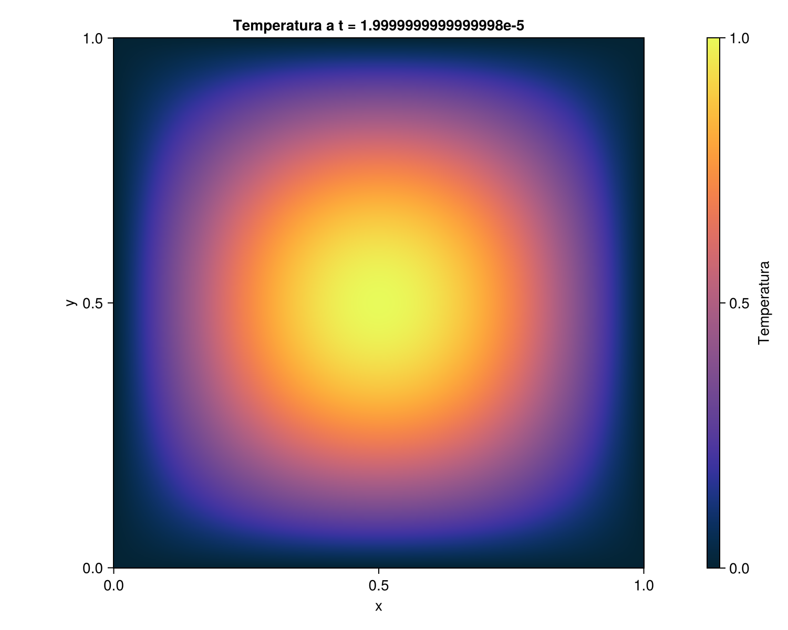

# Diffusione del calore in una piastra

Simulazione dell’equazione del calore bidimensionale in Julia, con differenze finite centrate nello spazio ed Eulero esplicito nel tempo.

La piastra ha una temperatura iniziale sinusoidale, massima al centro, e bordi mantenuti a temperatura zero. La distribuzione della temperatura è visualizzata con CairoMakie.

